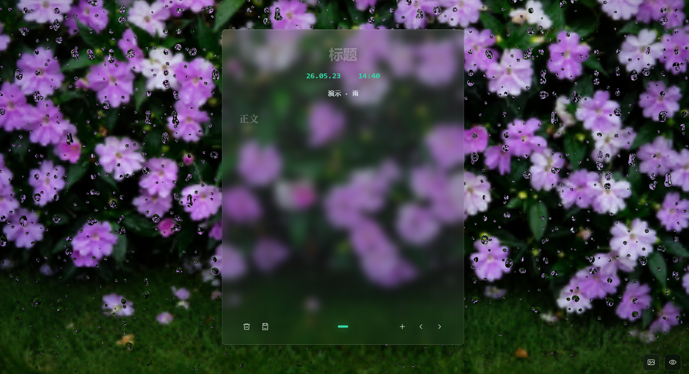
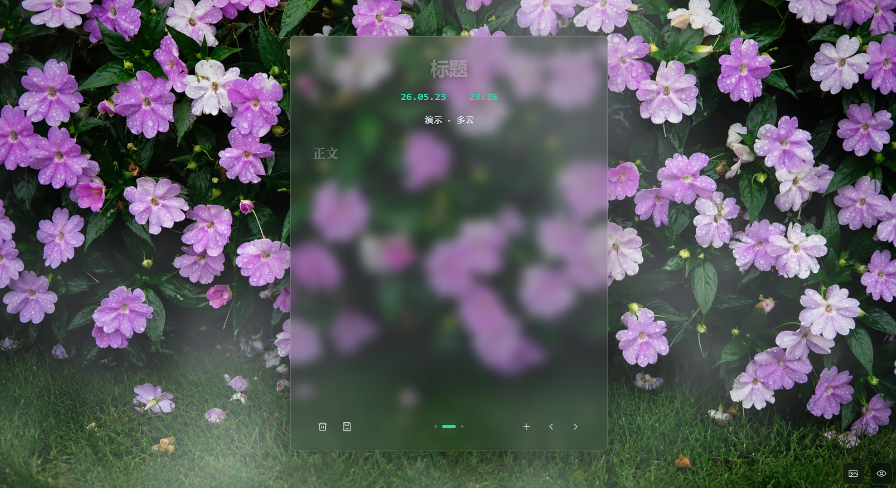

### 概括

每个文件夹都是一个独立项目，文件夹内有更详细的说明文档。这里先做一个简单介绍：

writeNotes：个人随笔信息记录工具，会根据当前所在地的实时天气切换页面背景。想体验雨天或者多云（阴天）效果，可以直接在 URL 后面加上 `?weather=rain`（多云就把单词换成cloud）。记录内容保存在项目内的 SQLite 数据库中。

Inspiration（新功能加入中...）：一个本地使用的 AI 灵感板，可以快速把截图和文本卡片保存到画布上，也可以在画布里自由拖拽排布，并用大模型自动提炼总结和关键词（推荐搜推理时代，里面找带'free'并且支持图片输入的模型，直接配置到.env里就能体验）。

### 演示

一：writeNotes

二：Inspiration

### 说明

灵感与设计复刻小红书博主妙妙Guo，并再其基础上进行二次创作

